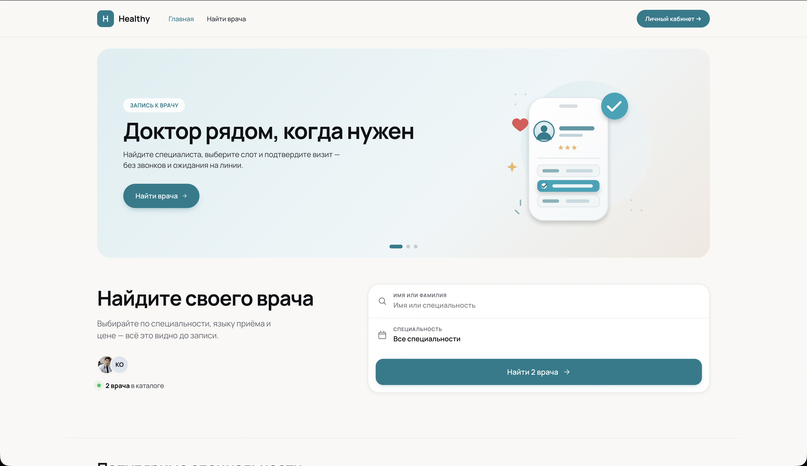
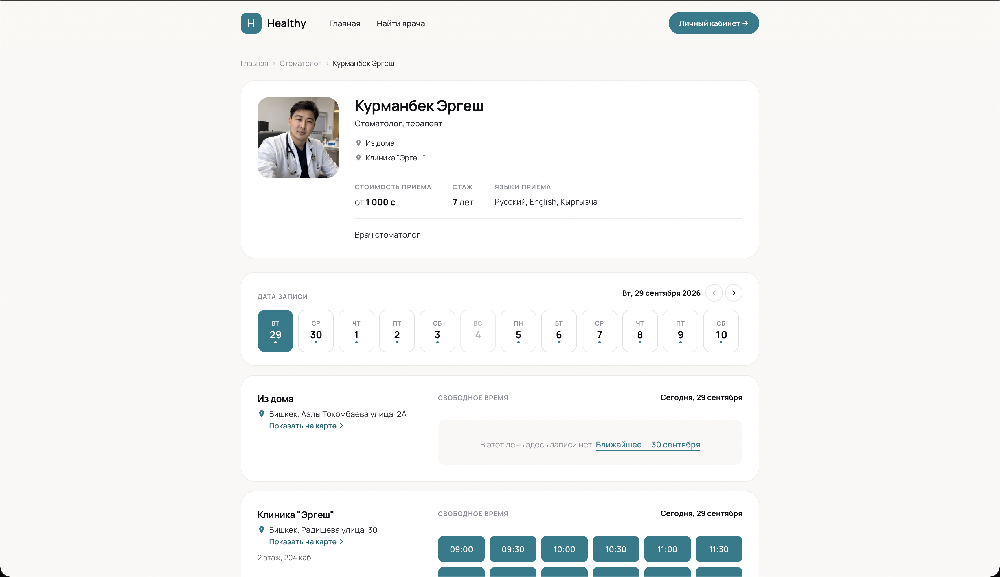
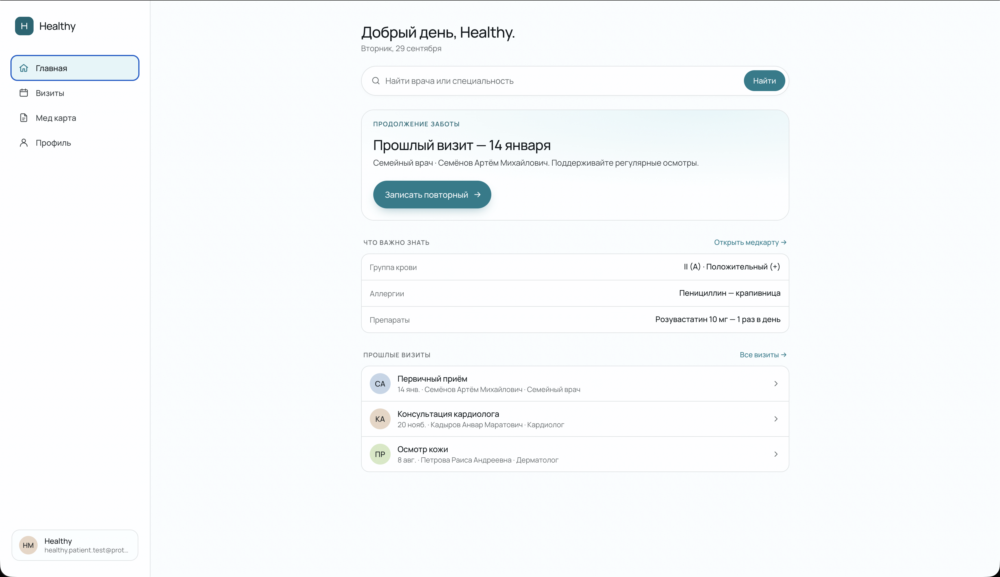
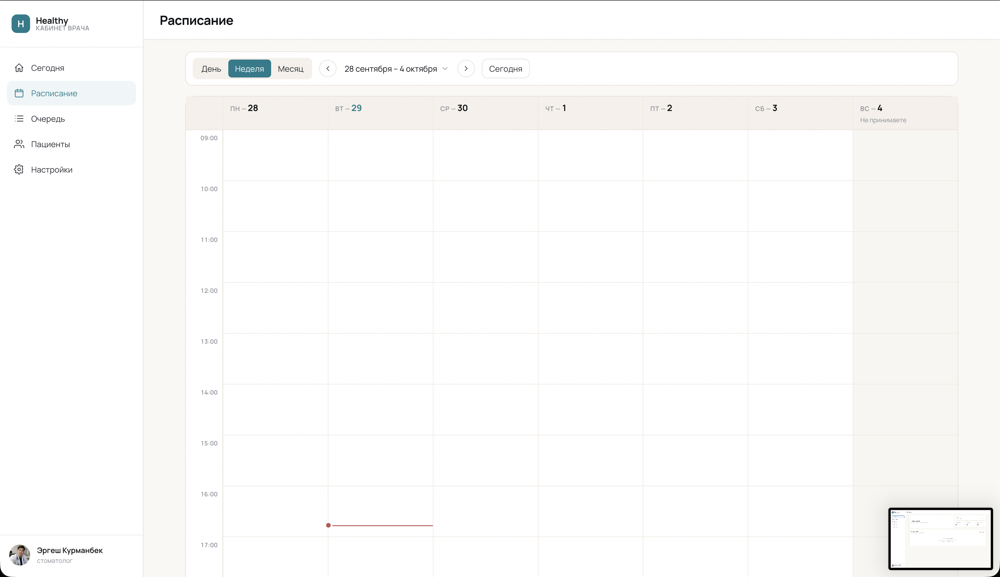
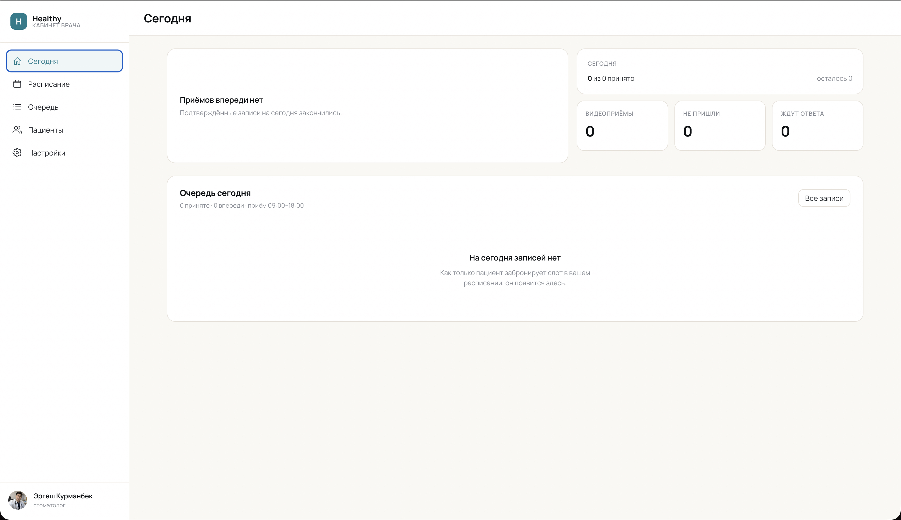

# Healthy

Healthy is an Astro and React frontend for discovering doctors, reviewing doctor profiles, starting an appointment booking flow, and using a patient portal. The public product is available at [sdoctorom.health](https://sdoctorom.health).

This repository contains the web frontend only. The production backend, infrastructure accounts, and operational data are not included.

## Dmitrii's role

Dmitrii Nadtochii developed and maintains the frontend represented in this repository. The Git history preserves automated Cloudflare commits separately from human-authored work.

## Patient Experience

### Doctor discovery

Search and discover healthcare professionals by specialty and availability.



### Appointment booking

Review doctor information, locations, available dates, and appointment slots.



### Patient dashboard

Review healthcare information, previous visits, and follow-up actions from the patient workspace.



## Doctor Workspace

### Doctor schedule

Weekly scheduling workspace for managing appointment availability and clinical workflow.



### Patient management

Doctor-facing workspace for reviewing appointment status and navigating patient management.



## Implemented features

- Public landing and doctor-search pages
- Search filtering, formatting, serialization, and URL state
- Doctor profile pages with clinic location and booking UI
- Sign-in, email verification, and password-reset screens
- Patient SPA with visits, visit details, history, and profile pages
- Responsive desktop and mobile navigation
- API clients for the public site and patient application
- SEO metadata, sitemap, robots response, and structured data

Password recovery is not complete: the current forgot-password entry point is a UI placeholder pending backend support.

## Architecture

The application has two frontend surfaces in one Astro project:

- `web/` contains the public, SEO-oriented Astro site.
- `src/` contains the React patient SPA mounted below `/app`.

The React application follows Feature-Sliced Design. Shared infrastructure and UI live in `shared`, domain models in `entities`, user actions in `features`, composed interface blocks in `widgets`, route-level screens in `pages`, and application providers/router setup in `app`.

## Tech stack

- Astro and the Cloudflare adapter
- React and TanStack Router
- TanStack Query and Zustand
- React Hook Form with Valibot/Zod validation
- Tailwind CSS
- TypeScript
- Vitest, Oxlint, Oxfmt, and Steiger
- Wrangler / Cloudflare Workers

## Project structure

```text
src/
  app/          React application bootstrap, providers, and routing
  entities/     Domain models and demo data
  features/     User-facing actions such as authentication
  pages/        Patient SPA route screens
  shared/       API, configuration, utilities, assets, and UI
  widgets/      Composed navigation and modal blocks
web/
  components/   Astro and React components for the public site
  layouts/      Public and application layouts
  lib/          API, authentication, booking, and search utilities
  pages/        Astro routes
  styles/       Public-site styles
```

## Local setup

Requirements:

- Node.js 24
- pnpm 11 (the exact package-manager version is declared in `package.json`)

```bash
corepack enable
pnpm install
cp .env.example .env
pnpm dev
```

The frontend expects a compatible backend API. Without one, API-backed authentication, catalog, and booking operations will not be fully functional.

## Environment variables

| Variable                 | Purpose                                                                          |
| ------------------------ | -------------------------------------------------------------------------------- |
| `PUBLIC_API_URL`         | Base URL of the backend API                                                      |
| `PUBLIC_YANDEX_MAPS_KEY` | Browser-visible Yandex Maps JavaScript API key; restrict it by allowed referrers |

Do not commit `.env` files. The checked-in `.env.example` documents the required names and contains no private credential.

## Scripts

| Command            | Purpose                                     |
| ------------------ | ------------------------------------------- |
| `pnpm dev`         | Start the Astro development server          |
| `pnpm build`       | Build with Cloudflare deployment variables  |
| `pnpm build:local` | Build using local environment configuration |
| `pnpm preview`     | Preview a production build                  |
| `pnpm test`        | Run Vitest once                             |
| `pnpm lint`        | Run Oxlint with type-aware checks           |
| `pnpm fmt:check`   | Check formatting                            |
| `pnpm fsd`         | Validate Feature-Sliced Design boundaries   |
| `pnpm typecheck`   | Run Astro and TypeScript checks             |
| `pnpm check`       | Run the configured pre-commit checks        |

## Testing and quality checks

Vitest coverage currently focuses on search-state helpers, formatting/serialization, doctor API/model utilities, and slug handling. Oxlint, Oxfmt, TypeScript, Astro checks, Steiger, and Lefthook provide the remaining static quality gates.

## Deployment

Astro builds the public pages and React application for Cloudflare Workers. `wrangler.jsonc` contains non-secret deployment configuration, while browser-visible and environment-specific values are supplied through the documented environment variables. Backend deployment is outside this repository.

## Demo data

The patient, clinician, clinic, contact, insurance, license, and review identities in the mock modules are deliberately fictional. They exist only to demonstrate interface states and are not medical records or real professional credentials.

## Portfolio context

This repository is published as a technical portfolio project. It demonstrates a mixed Astro/React frontend, domain-oriented modular architecture, typed API integration, responsive UI work, and Cloudflare-oriented delivery. It does not grant rights to reuse branding or imply that the production backend is open source.
